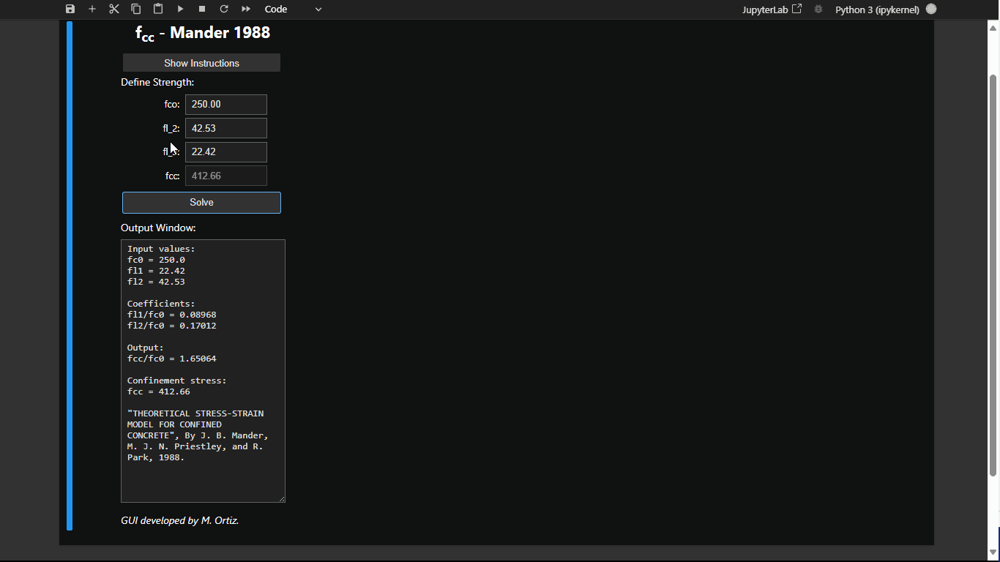

# ChartMander1988
Herramienta GUI que implementa el ábaco de Mander para calcular el ratio de confinamiento del hormigón, basado en el paper de Mander, Priestley y Park (1988). 



# INSTALACIÓN

## PARTE 1: Obtener los archivos del repositorio

### OPCIÓN A (Para principiantes): Descarga directa 🖥️
1. Ve al repositorio en GitHub
2. Haz clic en botón verde "Code"
3. Selecciona "Download ZIP"
4. Descomprime el archivo en tu computadora

### OPCIÓN B (Para usuarios con conocimientos técnicos): Clonar repositorio 👨‍💻
```bash
git clone https://github.com/MarceloX3/ChartMander1988
```

## PARTE 2: Configuración del Entorno
5. Abrir Anaconda Prompt
6. Crear entorno virtual
```bash
conda create -n ChartMander python=3.11
```
7. Activar entorno
```bash
conda activate ChartMander
```
8. Navegar a carpeta del proyecto
```bash
cd ruta/a/tu/proyecto
```
9. Instalar dependencias
```bash
pip install -r requirements.txt
```

## PARTE 3: Ejecución

### OPCIÓN A (Para principiantes): Ejecución manual
1. Abre Anaconda Prompt
2. Activa el entorno: `conda activate ChartMander`
3. Inicia Jupyter Notebook: `jupyter notebook`
4. Abre el archivo `S01_GUI_ChartMander1988.ipynb`
5. Ejecuta celda

### OPCIÓN B (Para usuarios con conocimientos técnicos): Ejecución desde un acceso directo

Un archivo `.bat` (batch) es un script ejecutable en sistemas Windows que permite automatizar tareas, como activar un entorno virtual y ejecutar un archivo `.ipynb`. Este método facilita iniciar el proyecto directamente desde un acceso directo.

#### Pasos para configurar y usar un archivo `.bat`:

1. **Identificar la ruta del entorno virtual:**
   - Abre la GUI ChartMander1988 acorde a las instrucciones de la Opción A.
   - Dentro del archivo `.ipynb` crea una nueva celda y ejecuta el siguiente código:
     ```python
     import sys
     print(sys.executable)
     ```
   - Copia el resultado, que es la ruta del entorno donde se ejecuta Jupyter.

2. **Crear el archivo `.bat`:**
   - Abre un editor de texto.
   - Copia y pega el siguiente código, reemplazando `RUTA_DEL_ENTORNO` con la ruta obtenida en el paso anterior:
     ```batch
     @echo off

     REM Configurar la ruta del entorno virtual
     set ANACONDAPATH=RUTA_DEL_ENTORNO

     REM Configurar variables del entorno
     start %ANACONDAPATH%\python.exe %ANACONDAPATH%\cwp.py %ANACONDAPATH% ^

     REM Abrir el archivo .ipynb especificado
     start %ANACONDAPATH%\python.exe %ANACONDAPATH%\Scripts\jupyter-notebook-script.py %1

     exit
     ```
   - Guarda el archivo con la extensión `.bat` (por ejemplo, `IniciarNotebook.bat`).

3. **Asociar el archivo `.bat` con archivos `.ipynb`:**
   - Haz clic derecho sobre el archivo `S01_GUI_ChartMander1988.ipynb` y selecciona "Propiedades".
   - En "Abrir con", selecciona el archivo `.bat` creado.
   - Esto permitirá abrir el entorno y ejecutar el archivo automáticamente al hacer doble clic.

4. **Crear un acceso directo y personalizarlo (opcional):**
   - Crea un acceso directo al archivo `S01_GUI_ChartMander1988.ipynb`.
   - Mueve el acceso directo a un lugar conveniente.
   - Personaliza el icono haciendo clic derecho en el acceso directo, seleccionando "Propiedades" > "Cambiar icono" y eligiendo un archivo `.ico` característico.

Este método proporciona una forma práctica y rápida de iniciar el proyecto sin necesidad de abrir manualmente el entorno o Jupyter Notebook.

